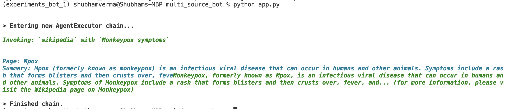
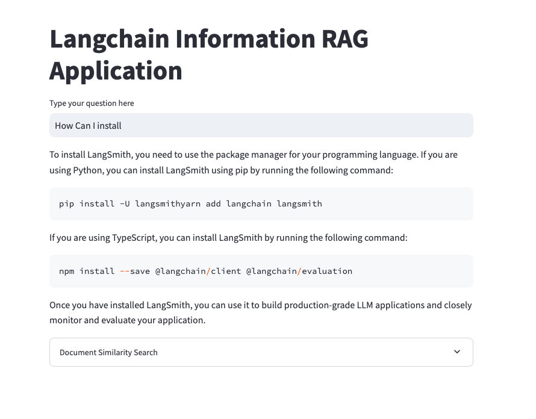
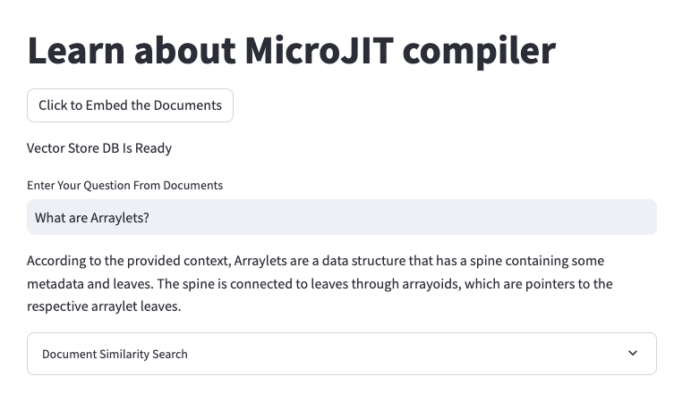
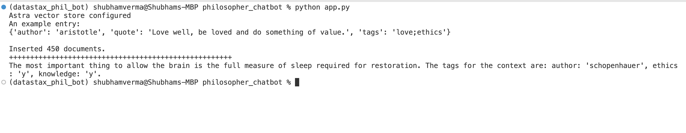

# RAG Applications


## 1. multi_source_bot

### Virtual environment
```bash
conda create -n mult_source_bot python=3.10 -y
conda activate mult_source_bot
```

### Setup
```bash
pip install -r requirements.txt
```

### RUN the code
```bash
cd multi_source_bot
python app.py
```

### Expected output



## 2. langsmith_info_bot

### Virtual environment
```bash
conda create -n langsmith_info_bot python=3.10 -y
conda activate langsmith_info_bot
```

### Setup
```bash
pip install -r requirements.txt
```

### RUN the code
```bash
cd langsmith_info_bot
python app.py
```

### Expected output



## 3. pdf_info_search


### Expected output



## 4. philosopher bot

data: https://huggingface.co/datasets/datastax/philosopher-quotes

### Virtual environment
```bash
conda create -n datastax_phil_bot python=3.10 -y
conda activate datastax_phil_bot
```

### Setup
**ragstack-ai** includes all the packages you need to build a RAG pipeline.
**datasets** is used to import a sample dataset

### Install the required packages
```bash
pip install -r requirements.txt
```
### RUN the code
```bash
cd philosopher_chatbot
python app.py
```

### Expected output



