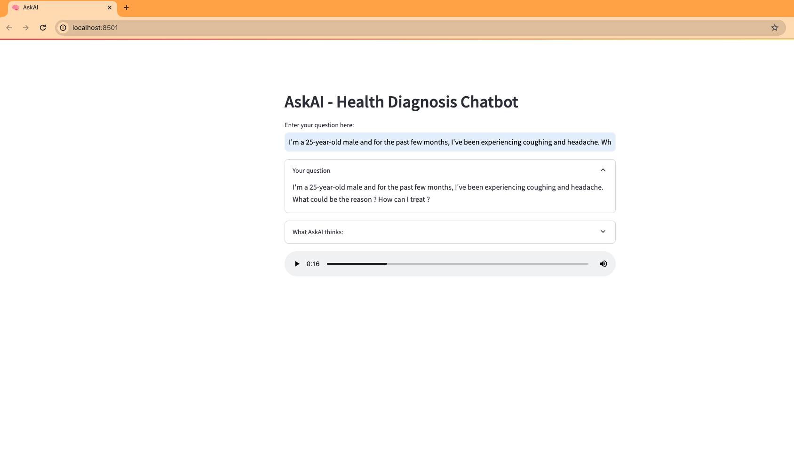

# AskAI-Health-Diagnosis-Companion
Utilizing advanced machine learning techniques including NLP, CNN, and large language and vision models, to offer immediate assistance and personalized healthcare guidance, with the goal of addressing accessibility and wait time challenges in the healthcare sector.

```diff
! In Progress
```


```diff
This repository is intended to showcase sample code of the project for public presentation.
The main repository is private (for confidentiality), but feel free to request the project architecture.
```


## Before you run, you need to set up virtual environment and install the required libraries


### Go inside the Backend directory
```bash
cd Experiments/Backend/
```

### Create a new conda environment with python 3.8
```bash
conda create -n HuggingFace_pract_3 python=3.8 -y
```

### Activate the conda environment
```bash
conda activate HuggingFace_pract_3
```

### Install the required libraries
```bash
pip install -r requirements.txt
```


### Create environment variables file
```bash
touch .env
```

### Add the following environment variables to the .env file
```bash
HUGGINGFACE_API_KEY=<your_huggingface_api_key>
```


## How run the streamlit app


```bash
cd Experiments/Backend/
streamlit run MedAdvice.py
```


## Additional:

### How to get accesss to huggingFace downloaded models on MacOS locally:
```bash
# Create a symbolic link to the huggingface cache directory
~/.cache/huggingface/hub/
```

### Sample output:



### Note:
- I am using Mistral model and not OpenAI or other models that require me to make use of LangChain, but you can easily add them to the code.
- I have provided sample snippet for using LangChain for the GPT model in the `MedAdvice.py` file.

   

### Next to do:
- Experiment with different gaurdrails options:
    - NeMO (NVIDIA)
    - Gorrila
    - Gaurdrails AI
- RAG: Look into Retrieval augmented models for better performance and avoid hallucinations.


# Bot_1: env = experiments_bot_1
- Packaged installed and ready to code.
pip install --upgrade botocore urllib3 and pip install awscli==1.32.18

- pip install streamlit
- pip install audio-recorder-streamlit
- pip install openai


# Bot_2: env = experiments_bot_2
- Packaged installed and ready to code. AddiionallyI had o run two commands:
 
- pip install streamlit
- pip install audio-recorder-streamlit
- pip install openai


# Bot_3: env = experiments_bot_3

install saparatly:
- pip install streamlit
- pip install audio-recorder-streamlit
- pip install openai

